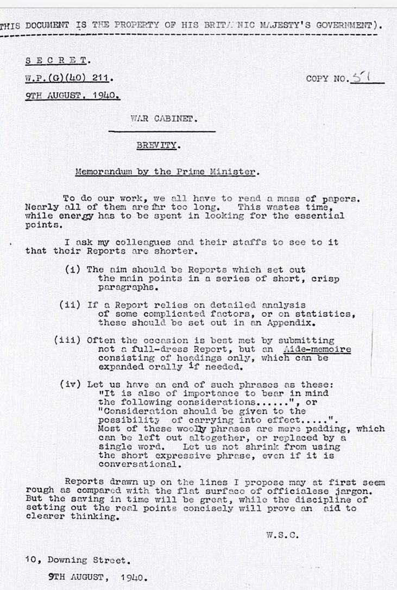

# Great Memos

A curated archive of historic business memos, strategic documents, and leadership correspondence from 112 AD to present.

*Winston Churchill's 1940 memo demanding concise reporting from military and government officials during WWII*

## What is this?

This site collects influential memos from business leaders, investors, politicians, and strategists. These documents showcase clear thinking, strategic vision, and decision-making at critical moments.

## How to contribute

Have a great memo? Submit a pull request:

1. Add your PDF to the `/memos` folder
2. Add an entry to `index.html` in the appropriate section
3. Run `python combine_pdfs.py` to update the combined download file
4. Submit your PR with a brief description of the memo's significance

---

Made by [Third South Capital](https://thirdsouth.capital/)
